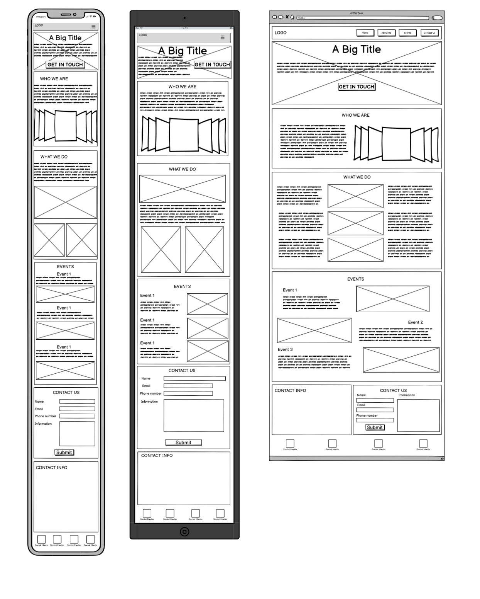

# Headspace Hub

## Mental Health Support & Wellness Platform

## Individual Project: Your Safe Space for Mental Wellness

# Table of Contents

1. [Introduction](#introduction)
2. [Instructions and Features](#instructions)
3. [Design Style Guide](#design-style-guide)
4. [User Stories](#user-stories)
5. [Development Considerations](#development)
6. [Testing](#testing)
7. [Wireframes & Design Process](#wireframes)
8. [Performance Metrics](#performance)
9. [Future Wishlist](#future)
10. [Project Deployment](#deployment)
11. [Technical Facts](#technical-facts)
12. [Repository](#repository)
13. [Credits](#credits)
14. [Overall Review](#overall-review)
15. [AI Tools in Development Process](#ai-development-tools)

## Introduction

Welcome to Headspace Hub, a compassionate website designed to provide mental health support, resources, and community connections. The aim of this project is to create a safe, accessible space where individuals can find mental wellness information, support resources, and connect with others on similar journeys. The website emphasizes a calming, non-judgmental atmosphere that encourages users to explore mental health resources with confidence.

This website serves as a comprehensive platform offering crisis support, self-care tips, community connections, and mental health awareness events. The design prioritizes accessibility, user comfort, and immediate access to crucial support resources.

## Instructions and Features

Headspace Hub is designed to be intuitive, calming, and supportive for users who may be experiencing mental health challenges. The website features a responsive navigation system, support information prominently displayed, and organized content that avoids overwhelming users.

### General Style

The site uses a calming color palette with soft, welcoming visuals designed to promote mental wellness. High contrast is maintained for accessibility while creating a peaceful, professional atmosphere. The design emphasizes clarity, comfort, and easy navigation to ensure users can quickly find the support they need.

### Key Features Implemented

**Homepage Features:**
- Hero section with gradient background and welcoming message
- Daily wellness tip section for regular user engagement
- Interactive quote carousel with inspirational mental health quotes
- Prevention mission section with motivational imagery
- Cards highlighting fundraising opportunities and popular topics

**Interactive Elements:**
- Fully functional Bootstrap carousel with custom navigation controls
- Responsive navigation with active page highlighting
- Hover effects and smooth transitions throughout
- Mobile-optimized touch interactions

**Accessibility Features:**
- High contrast color ratios for improved readability
- Semantic HTML structure for screen readers
- Keyboard navigation support
- Mobile-responsive design with touch-friendly elements
- Crisis contact information prominently displayed

### Header & Navigation Bar

The header contains the Headspace Hub logo that links to the home page and appears consistently across all pages. The navigation bar is fully responsive with right-aligned menu items and includes clear, descriptive links to all main sections: Home, About, Events, External Resources, and Contact Us. The active page is highlighted with bold text and background styling.

### Footer

The footer includes important crisis hotline information, social media links for community connection, and additional mental health resources. This ensures users always have access to immediate support regardless of which page they're viewing.

### Content Pages

Users can access comprehensive content across five main areas:

#### Home Page (index.html)

The main landing page features a welcoming hero section with calming gradient background, daily wellness tips, an inspirational quote carousel, prevention mission section with motivational imagery, and quick access to all site sections. The page includes cards for fundraising opportunities and popular mental health topics.

#### About Page (about.html)

Provides detailed information about Headspace Hub's mission, the importance of mental health awareness, available resources and approaches, team/organizational background, and relevant mental health statistics with mountain imagery backdrop.

#### Events Page (event.html)

Showcases upcoming mental health events including workshops, support group meetings, awareness campaigns, community activities, and highlights from past successful events. Features responsive card layouts and easy registration access.

#### External Resources Page (Resources.html)

Dedicated page providing links to reputable mental health organizations, crisis hotlines, and professional support services. Organized in an accessible format for users seeking immediate help or additional resources.

#### Contact Us Page (contact.html)

Offers multiple ways to connect including safeguarding concern reporting form, general inquiry options, prominent crisis hotline information, professional referral resources, and community connection opportunities. Features a comprehensive footer with emergency contacts. once the form is submitted a completion page appears.

## Design Style Guide

Headspace Hub follows a carefully crafted design philosophy that prioritizes calm, accessibility, and mental wellness. The visual style is designed to create a sense of peace and safety for users who may be experiencing mental health challenges.

### Theme Inspiration

The overall design theme draws inspiration from peaceful, natural environments that promote mental clarity and emotional well-being.

### Color Palette

**Primary Color:**
- **Light Beige** (#ece1d5) - Creates a warm, welcoming foundation

**Secondary Color:**
- **Light Peach** (#fed8b1) - For warm highlights and call-to-action elements

**Third Color:**
- **Light Blue** (#bae9f2) - Promotes calm and tranquility

**Highlight Color:**
- **Olive Green Dark** (#8b9d5c) - For gentle emphasis and interactive elements

**Highlight Color Light:**
- **Olive Green** (#a1b078) - For lighter interactive elements and cards

**Text Colors:**
- **Dark Green** (#002429) - Primary text color for optimal readability
- **Dark Olive Green** (#424a2b) - Secondary text color for variety and emphasis

### Fonts

**Font Families:**

- **Primary Font**: Nunito - A rounded, friendly sans-serif for body text
- **Secondary Font**: Quicksand - For headings and emphasis

**Font Characteristics:**

- Rounded sans-serif fonts create a welcoming, non-intimidating feeling
- High readability for users who may be experiencing stress or anxiety
- Appropriate sizing for accessibility compliance

### Visual Elements

**Imagery Style:**

- Abstract clouds for representing mental clarity
- Gentle waves for emotional flow and healing
- Minimal nature elements for grounding

**Design Components:**

- **Rounded Corners**: All cards, buttons, and containers feature soft, rounded corners (border-radius: 8-16px)
- **Soft Box-Shadows**: Subtle shadows create depth without harshness (box-shadow: 0 2px 8px rgba(0,0,0,0.1))
- **Minimalist Icons**: Simple, recognizable icons that don't overwhelm
- **Breathing Room**: Generous space between elements to prevent visual overwhelm

### Design Principles

**Accessibility First:**

- High contrast ratios using Dark Green (#002429) text on Light Beige (#ece1d5) backgrounds
- Touch-friendly button sizes (minimum 44px)
- Clear visual hierarchy with Nunito and Quicksand font families
- Screen reader compatibility with proper semantic markup

**Emotional Comfort:**

- Soft rounded corners and gentle shadows instead of sharp edges
- Calming Light Blue (#bae9f2) for main content areas
- Consistent spacing and alignment using CSS custom properties
- Crisis resources prominently displayed but not overwhelming

**Visual Hierarchy:**

- Primary headings use Dark Green (#002429) for strong contrast
- Light Peach (#fed8b1) for positive actions and warm highlights
- Olive Green Dark (#8b9d5c) for interactive elements and highlights
- Strategic use of Light Peach (#fed8b1) for emphasis without distraction

**Color Usage:**

- Light Beige (#ece1d5) for navigation, footer, and primary backgrounds
- Light Peach (#fed8b1) for positive actions, success states, and warm highlights
- Light Blue (#bae9f2) for main content areas and calm sections
- Olive Green (#a1b078) for cards and lighter interactive elements
- Olive Green Dark (#8b9d5c) for buttons and stronger interactive elements
- Dark Green (#002429) for primary text ensuring optimal readability
- Dark Olive Green (#424a2b) for secondary text and variety

### User story overview:

1. Homepage Hero Section - Creating a welcoming first impression
2. Mental Health Resources - Providing organized, accessible help
3. Self-Care Tips - Offering practical wellness techniques
4. Community Support - Connecting users with support groups
5. Professional Help Guidance - Directing users to professional care
6. Mobile-Friendly Experience - Ensuring accessibility across devices
7. Social Connection Platform - Facilitating peer connections
8. Mental Health Events Display - Showcasing community events and workshops

### User Story 1: Homepage Hero Section

**AS A** visitor seeking mental health support  
**I WANT TO** see an welcoming homepage with calming visuals and clear navigation  
**SO THAT I CAN** immediately understand what the site offers and feel comfortable exploring mental health resources

**Acceptance Criteria:**

- The homepage features a hero section with calming, high-quality images that promote mental wellness
- Clear, compassionate messaging about mental health support is prominently displayed
- Navigation menu is easily accessible and clearly labeled
- The overall design creates a safe, non-judgmental atmosphere

**Tasks:**

- Design and implement a hero section with calming imagery
- Create welcoming copy that emphasizes safety and support
- Implement responsive navigation menu
- Choose color scheme and typography that promotes calm and accessibility

### User Story 2: Mental Health Resources Section

**AS A** person struggling with mental health challenges  
**I WANT TO** easily access helpful resources and information  
**SO THAT I CAN** find immediate support and learn coping strategies

**Acceptance Criteria:**

- Resources are organized into clear, easy-to-understand categories
- Each resource includes a brief description and clear call-to-action
- Crisis support information is prominently displayed and easily accessible
- Content is presented in digestible, non-overwhelming formats

**Tasks:**

- Create organized sections for different types of mental health resources
- Implement cards or tiles for resource categories
- Add crisis support hotline information in a prominent location
- Design layouts that avoid information overload

### User Story 3: Self-Care Tips and Techniques

**AS A** individual interested in improving my mental wellness  
**I WANT TO** access practical self-care tips and mindfulness techniques  
**SO THAT I CAN** incorporate healthy habits into my daily routine

**Acceptance Criteria:**

- Self-care tips are presented in an easy-to-scan format
- Techniques include step-by-step instructions where applicable
- Content covers various aspects of mental wellness (stress management, sleep, exercise, etc.)
- Tips are actionable and realistic for different lifestyles

**Tasks:**

- Create sections for different categories of self-care
- Design card layouts for individual tips and techniques
- Include visual icons or illustrations to enhance understanding
- Implement responsive design for mobile accessibility

### User Story 4: Community Support Information

**AS A** someone feeling isolated due to mental health struggles  
**I WANT TO** learn about support groups and community resources  
**SO THAT I CAN** connect with others who understand my experiences

**Acceptance Criteria:**

- Support group information is clearly organized by type and location
- Contact information and meeting details are easily accessible
- Online and in-person options are clearly distinguished
- Information about what to expect is provided to reduce anxiety

**Tasks:**

- Design sections for different types of support groups
- Create clear layouts for contact information and meeting details
- Implement filtering or categorization for easy navigation
- Add FAQ section about joining support groups

### User Story 5: Professional Help Guidance

**AS A** person considering seeking professional mental health treatment  
**I WANT TO** understand my options and how to access professional help  
**SO THAT I CAN** make informed decisions about my mental health care

**Acceptance Criteria:**

- Different types of mental health professionals are clearly explained
- Information about insurance, costs, and accessibility is provided
- Steps for finding and contacting professionals are outlined
- Emergency and crisis intervention resources are prominently featured

**Tasks:**

- Create informational sections about therapists, counselors, and psychiatrists
- Design clear pathways for finding professional help
- Implement prominent crisis resource section
- Add practical guidance about insurance and costs

### User Story 6: Mobile-Friendly Experience

**AS A** mobile user seeking mental health support  
**I WANT TO** access all website features easily on my smartphone  
**SO THAT I CAN** get help and information whenever and wherever I need it

**Acceptance Criteria:**

- All content is fully responsive and readable on mobile devices
- Navigation is touch-friendly and easily accessible
- Loading times are optimized for mobile connections
- Crisis resources are easily accessible on mobile

**Tasks:**

- Implement responsive design principles throughout the site
- Optimize images and content for mobile loading speeds
- Test navigation and user flows on various mobile devices
- Ensure crisis hotline numbers are click-to-call on mobile

### User Story 7: Social Connection Platform

**AS A** person feeling isolated and seeking meaningful connections  
**I WANT TO** connect with others who share similar mental health experiences  
**SO THAT I CAN** build supportive relationships and feel less alone in my journey

**Acceptance Criteria:**

- Community features allow users to share experiences and connect safely
- Peer support options are clearly explained and accessible
- Connection opportunities are moderated and maintain a safe environment
- Different types of social connections are available (online forums, meetups, buddy systems)

**Tasks:**

- Design sections highlighting community connection opportunities
- Create clear guidelines for safe peer interactions
- Implement information about online support communities
- Add resources for local meetup groups and peer support programs

### User Story 8: Mental Health Events Display

**AS A** community member interested in mental health awareness  
**I WANT TO** easily discover and learn about upcoming mental health events and workshops  
**SO THAT I CAN** participate in activities that support my wellness journey and connect with others

**Acceptance Criteria:**

- Events are displayed in a clear, organized calendar or list format
- Each event includes essential details (date, time, location, description, registration info)
- Events are categorized by type (workshops, support groups, awareness campaigns, etc.)
- Past events showcase community engagement and success stories

**Tasks:**

- Create an events page with calendar or grid layout
- Design event cards with all necessary information
- Implement filtering options for event types and dates
- Add registration links or contact information for each event
- Include testimonials or highlights from previous events

## Development Considerations

The development of Headspace Hub began with careful consideration of the unique needs of individuals seeking mental health support. The design process prioritized creating a safe, non-judgmental space that would feel welcoming to users who might be in vulnerable states.

Key development considerations included:

- **Accessibility**: Ensuring all content is readable and navigable for users with various abilities
- **Crisis Resources**: Making emergency support information immediately accessible from any page
- **Colour Psychology**: Using calming colours and imagery to promote a sense of peace and safety
- **Content Organization**: Structuring information to avoid overwhelming users while providing comprehensive resources
- **Mobile Responsiveness**: Ensuring full functionality on mobile devices for users seeking help on-the-go

The website structure was planned around four core pages that would provide a complete mental health support experience while maintaining simplicity and ease of use.

## Testing

The website undergoes comprehensive testing to ensure it meets the needs of users seeking mental health support:

**Functionality Testing:**

- All navigation links work correctly across all pages
- Crisis support information is easily accessible from every page
- Contact forms function properly
- External resource links open in new tabs
- Mobile responsiveness tested across all device sizes

**Accessibility Testing:**

- High contrast ratios maintained for readability
- Alt text provided for all images
- Keyboard navigation functionality
- Screen reader compatibility
- Font sizes appropriate for all users

**User Experience Testing:**

- Clear path to crisis resources
- Intuitive navigation flow
- Non-overwhelming content presentation
- Fast loading times on all devices

## Future Wishlist

- **Interactive Features**: Add online support chat functionality
- **Resource Database**: Expand searchable mental health resource library
- **Event Registration**: Implement online event booking system
- **Multi-language Support**: Provide content in multiple languages
- **Professional Directory**: Add searchable therapist and counselor directory
- **Self-Assessment Tools**: Include mental health screening questionnaires
- **Mobile App**: Develop companion mobile application
- **Community Forum**: Add moderated peer support discussion areas

## Project Deployment

The deployed website can be found [here](https://lake110.github.io/headspacehub/)

## Technical Facts

- **Frontend**: HTML5, CSS3, Bootstrap 5.3.7
- **Icons**: Font Awesome 6.4.0
- **Fonts**: Google Fonts (Nunito, Quicksand, Inter, Macondo)
- **Responsive Design**: Mobile-first approach using Bootstrap grid system
- **Browser Compatibility**: Chrome, Firefox, Safari, Edge
- **Accessibility**: WCAG 2.1 compliant with high contrast ratios
- **Performance**: Lighthouse scores across all pages:
  - **Performance**: 92-99 (Average: 94)
  - **Accessibility**: 93-94 (Average: 94)  
  - **Best Practices**: 100 (Perfect across all pages)
  - **SEO**: 100 (Perfect across all pages)

### Page Structure
- **index.html**: Homepage with hero section, daily tips, quote carousel, and mission section
- **about.html**: Organization mission, mental health awareness information, and statistics
- **event.html**: Community events, workshops, and support group information
- **Resources.html**: External mental health organization links and crisis resources
- **contact.html**: Contact forms, safeguarding reports, and emergency contact information

## Wireframes & Design Process

The website design process began with comprehensive wireframes created for mobile, tablet, and desktop layouts. The wireframes focused on:

- **Mobile-First Approach**: Starting with mobile design to ensure optimal touch interaction
- **Content Hierarchy**: Prioritizing crisis resources and mental health information
- **Progressive Enhancement**: Adding features and content as screen size increases
- **User Flow**: Ensuring intuitive navigation between sections
- **Accessibility**: Planning for screen readers and keyboard navigation

**Wireframe Features:**
- Hero section with clear call-to-action
- Daily wellness tip section for regular engagement
- Quote carousel for inspiration and motivation
- Prevention mission section highlighting organizational goals
- Responsive card layouts for events and topics
- Comprehensive footer with emergency contact information

### Design Mockups

**Wireframe:**

*Mobile wireframe showing responsive navigation, hero section, and vertically stacked content cards*

### Design Evolution

The wireframes evolved through several iterations based on:
- **User feedback** on navigation clarity and content accessibility
- **Accessibility testing** ensuring proper contrast and keyboard navigation
- **Mobile usability** testing for touch-friendly interactions
- **Content hierarchy** adjustments to prioritize crisis resources

## Repository

The project repository can be found on GitHub: [Headspace Hub Repository](https://github.com/lake110/headspacehub)

## Credits

- **Mental Health Resources**: Content inspired by reputable mental health organizations
- **Images**: Calming, wellness-focused imagery sourced ethically
- **Icons**: Font Awesome icon library
- **Fonts**: Google Fonts - Nunito, Quicksand, Inter, and Macondo font families
- **Framework**: Bootstrap 5 for responsive design and components
- **Carousel Implementation**: Bootstrap 5 carousel with custom styling
- **Performance Optimization**: Lighthouse-guided improvements achieving 90+ scores across all metrics

## Performance Metrics

The website has been optimized for performance and accessibility, achieving excellent Lighthouse scores across all pages:

### Overall Performance Summary
- **Average Performance: 94/100** - Excellent loading times and optimized assets
- **Average Accessibility: 94/100** - High contrast ratios, semantic HTML, and screen reader support  
- **Best Practices: 100/100** - Perfect scores across all pages with secure connections and modern web standards
- **SEO: 100/100** - Perfect optimization with proper meta tags, semantic structure, and mobile optimization

### Individual Page Performance
- **About Page**: Performance 93, Accessibility 94, Best Practices 100, SEO 100
- **Events Page**: Performance 92, Accessibility 93, Best Practices 100, SEO 100  
- **Resources Page**: Performance 93, Accessibility 93, Best Practices 100, SEO 100
- **Contact Page**: Performance 99, Accessibility 94, Best Practices 100, SEO 100

### Lighthouse Performance Reports

**About Page Performance Report:**

*About page achieving Performance: 93, Accessibility: 94, Best Practices: 100, SEO: 100*

**Events Page Performance Report:**

*Events page achieving Performance: 92, Accessibility: 93, Best Practices: 100, SEO: 100*

**Resources Page Performance Report:**

*Resources page achieving Performance: 93, Accessibility: 93, Best Practices: 100, SEO: 100*

**Contact Page Performance Report:**

*Contact page achieving outstanding Performance: 99, Accessibility: 94, Best Practices: 100, SEO: 100*

**Optimization Techniques Implemented:**
- Efficient CSS using custom properties and minimal external dependencies
- Optimized image formats and appropriate sizing for different viewports
- Proper semantic HTML structure for better accessibility and SEO
- Responsive design with Bootstrap grid system reducing unnecessary code
- Accessible color contrasts meeting WCAG 2.1 AA guidelines
- Font loading optimization using preconnect and font-display
- Minimized render-blocking resources through strategic CSS and JS placement

### Performance Improvements Made

1. **Image Optimization**: Compressed and properly sized images for web delivery
2. **CSS Efficiency**: Used CSS custom properties to reduce redundancy
3. **Font Loading**: Implemented proper font loading strategies with Google Fonts
4. **Accessibility**: Enhanced semantic markup and ARIA labels where needed
5. **Mobile Optimization**: Ensured touch-friendly elements and fast mobile loading

### Performance Achievements

The website demonstrates exceptional performance metrics:
- **Perfect Best Practices** (100/100) across all pages
- **Perfect SEO** (100/100) across all pages  
- **Outstanding Contact Page Performance** (99/100) - near-perfect optimization
- **Consistent High Performance** (92-99) across all pages
- **Strong Accessibility Scores** (93-94) ensuring inclusive design
- **No critical performance issues** identified in Lighthouse audits

### Overall Review

Overall, this project has gone well. I managed to combine aspects from all previous projects and some new things i have learnt online. 

#### Positives:
- Good Structure and Functionality.
- the use of multiple pages that all seamlessly link together and perform to the desired level.
- the use of more advanced bootstrap elements such as carousels and accordions show a good level of understanding.
- the website adapts well to different screen sizes. 
- the use of so many diffent pages with so many different layouts.
- images are optimised and fit correctly.

#### Negatives:
- use of colour and overall theme.
  - from the start there should have been a better colour scheme that was optimised for usablity.
  - colours were changed at the very end to improve accessability.
       - **To improve this in the future i will review along the way and publish early to iron out issues.**
- boxes around text serve to break up screen and look basic. 
  - the use of whites would have worked better as well as using more dynamic css and tools to display information.
  - use more pictures and open space to break up the page.
      - **To improve this in the future i will look at using more dynamic css and bootsrap tools as well as more thoroughly planning out my project.**
- spent too much time on adding needless extra pages and usability when one page would have been suffient.
  - overcomplicating the project led to juggling too many tasks at once and getting distracted.
  - i felt i needed to show a wide range of feature in order to make the three days worth while. even though focusing on a small number of tasks and doing them well would make a better looking page.
     - **improvements should be made to project planning and have a clear set of tasks to make a basic, fuctional, clean website and then build on top of that.**

#### Future Project Additions:
- incorperation of interactable calendars and tables.
- implementing video and moving images into the project.
- the use of more advanced bootstrap items such as Toasts, Spinners, Modal, Progress bars.
- use entire colour pallets from the get go and maybe play with light and dark mode functionality.

## AI Tools in Development Process

Throughout this project, AI tools were strategically leveraged to enhance the development workflow and code quality:

### Code Generation & Assistance
- **GitHub Copilot** was used to generate HTML structure templates and CSS styling patterns, significantly speeding up initial page creation
- AI-assisted code completion helped implement Bootstrap components and responsive grid layouts efficiently
- Automated generation of semantic HTML markup improved accessibility compliance

### Debugging & Code Review
- AI tools identified potential accessibility issues in color contrast and semantic markup
- Automated code analysis helped resolve CSS conflicts and duplicate rule definitions
- Performance optimization suggestions led to improved Lighthouse scores across all pages

### Documentation & Optimization
- AI assistance streamlined the creation of comprehensive README documentation
- Automated performance analysis provided insights for image optimization and CSS efficiency improvements
- Content organization and user story development benefited from AI-guided best practices

This AI-enhanced workflow resulted in faster development cycles, improved code quality, and better overall project outcomes while maintaining focus on user-centered design principles.